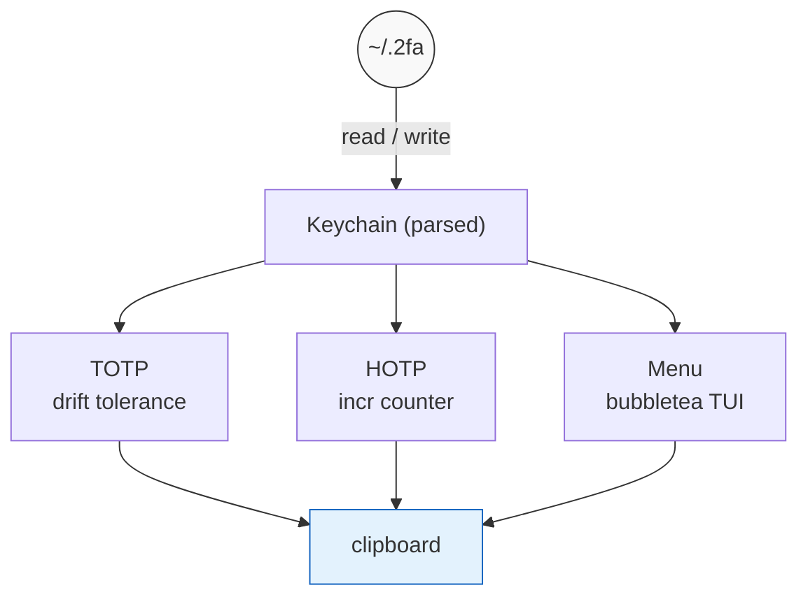

# 2fa — Two-Factor Auth Agent

<a href="#"></a>
<a href="#"></a>

A zero-frills TOTP/HOTP authenticator that lives in your terminal. No phone app,
no browser extension — just a single Go binary and a plaintext (or optionally
encrypted) keychain file.

Forked from [the Go authors' 2fa](https://github.com/rsc/2fa).
Adds an interactive TUI menu with live countdown, clipboard by default,
AES-256-GCM encryption, HOTP support, OTP URI import, keychain validation,
export/import for migration, and cross-platform clipboard (macOS, Windows,
Linux).

---

## Migrating to a new machine

```bash
# On the old machine:
2fa export > 2fa-keys.txt

# Copy 2fa-keys.txt to the new machine (scp, usb, whatever)

# On the new machine:
2fa import < 2fa-keys.txt
```

This works regardless of whether the keychain is encrypted — `export` always
outputs decrypted plaintext, and `import` will re-encrypt if `2FA_PASS` is set
on the new machine.

You can also just copy the raw file directly:

```bash
scp old-machine:~/.2fa new-machine:~/.2fa
```

But `export`/`import` is safer when encryption is involved — it handles
decrypting on the source and re-encrypting on the destination.

---

## Quick start

Download the latest release from [the Releases page](https://github.com/pharrisee/2fa/releases) (Linux, macOS, Windows — tarball or zip), or with Go installed:

```
go install github.com/pharrisee/2fa@latest
```

Then add a key and get a code:

```
2fa add github
2fa key for github: uksroa3fjae252vu

2fa github
760414

# Interactive menu (default)
2fa

# See all codes at once
2fa all
```

---

## Usage

| Command | What it does |
|---------|-------------|
| `2fa` | Interactive menu (default) with live countdown |
| `2fa <name>` | Print + copy a code (case-insensitive) |
| `2fa add [--hotp] [--7¦--8] <name>` | Add a new key |
| `2fa add <otpauth://URI>` | Import a key from an otpauth:// URI |
| `2fa delete <name>` | Delete a key |
| `2fa rename <old> <new>` | Rename a key |
| `2fa list` | List all stored key names |
| `2fa all` | Print codes for all time-based keys |
| `2fa export` | Print decrypted keychain to stdout |
| `2fa import` | Read keychain from stdin and write to file |
| `2fa validate` | Check keychain file integrity |
| `2fa version` | Print version |

### Adding a key

`2fa add <name>` prompts on stderr for the secret, reads it from stdin.
Secrets are short case-insensitive strings of letters A–Z and digits 2–7
(the standard base32 encoding used by Google Authenticator and friends).

You can also pass an `otpauth://` URI (the standard export format used by
Google Authenticator, Authy, etc.) directly as the argument — the secret,
name, type (TOTP/HOTP), and digit count are extracted automatically. No
stdin prompt needed:

```bash
2fa add "otpauth://totp/GitHub:phil@example.com?secret=JBSWY3DPEHPK3PXP&issuer=GitHub"
```

**Flags:**
| Flag | Effect |
|------|--------|
| *(none)* | TOTP (time-based), 6 digits |
| `-hotp` | HOTP (counter-based) instead of TOTP |
| `-7` | 7-digit codes |
| `-8` | 8-digit codes |

Flags are ignored when importing an `otpauth://` URI (the URI specifies
everything).

### Deleting / renaming keys

```bash
2fa delete github          # remove a key
2fa rename github gh        # rename a key
```

Both operations use case-insensitive lookup (same as `2fa <name>`).

### Validating the keychain

```bash
2fa validate
```

Parses every line in the keychain and reports:
- Missing or extra fields
- Invalid digit counts (must be 6, 7, or 8)
- Invalid base32 secrets
- Bad HOTP counter fields (wrong width or non-numeric)
- Duplicate key names

### Getting a code

**`2fa name`** — finds the key (case-insensitive), generates the code,
copies it to the clipboard, and prints it.

**`2fa`** (no args) — opens an interactive TUI with a highlighted list.
Arrow keys move the highlight, typing filters the list, Enter selects.
The code is copied to clipboard.

Each entry shows a live countdown (`[12s]`) for TOTP keys, updated every
second. HOTP keys display `[HOTP]` instead.

**`2fa all`** (no args) — prints codes for all time-based keys side-by-side.

**Case-insensitive lookup** — `2fa gitlab` matches `Gitlab`, `GITHUB`
matches `GitHub`. If two keys differ only by case, it'll tell you.

---

## Keychain file

The keychain lives at `$HOME/.2fa` (override with `$2FA_FILE`).

### Plaintext format (default)

Each line: `name digits base32secret [counter]`

```
github 6 EXOL2RVI5NHZN4P3
gitlab 6 M454VBSCIRHXLZZH
slack 8 CPJCTJNNHACYIPWT  00000000000000000000
```

The optional `counter` field (20 zero-padded digits) marks a key as HOTP.

### Encrypted format

Set the environment variable `2FA_PASS` to enable AES-256-GCM encryption
with Argon2id key derivation:

```bash
export 2FA_PASS="your-secret-passphrase"
2fa add myservice     # file is encrypted on write
```

Encrypted files are prefixed with `2FA!v1\n` followed by base64-encoded
`salt || nonce || ciphertext`. Unencrypted files (no header) remain fully
backward compatible.

If the file is encrypted but `2FA_PASS` is unset, 2fa errors out with a
helpful message. If the file is plaintext and `2FA_PASS` is set, it's
upgraded to encrypted on the next write.

---

## Architecture



- **TOTP**: RFC 6238 — HMAC-SHA1, 30s time step, dynamic truncation, ±1 window tolerance
- **HOTP**: RFC 4226 — HMAC-SHA1, counter persisted in-file, auto-incremented on use
- **Encryption**: AES-256-GCM + Argon2id (time=3, mem=64MB, threads=4)
- **Clipboard**: cross-platform via `wl-copy`/`xclip`/`xsel` (Linux), `pbcopy` (macOS), or `clip` (Windows)
- **TUI**: custom `bubbletea` model with real-time filtering, no external widget deps

---

## Example: full GitHub 2FA flow

1. Go to GitHub Settings → Password and authentication →
   **Enable two-factor authentication**
2. At "Scan this barcode with your app", click
   **"enter this text code instead"**
3. Copy the secret and add it:

```
$ 2fa add github
2fa key for github: nzxxiidbebvwk6jb
$
```

4. Whenever prompted, get a code:

```
$ 2fa github
268346
```

That's it. The code is in your clipboard and on your screen.

---

## Development

```bash
git clone https://github.com/pharrisee/2fa
cd 2fa
go build -o ~/.local/bin/2fa .
go vet ./...
```

Simple Go project, no build system. Implementation in `internal/app/`. The only external dependencies are:

| Dependency | Purpose |
|-----------|---------|
| `charmbracelet/bubbletea` | TUI framework for `menu` |
| `golang.org/x/crypto/argon2` | Key derivation for encrypted keychain |

---

## Notes

- TOTP codes are derived from a hash of the key and the current time (30s window
  with ±1 tolerance). System clock should be accurate within ~90 seconds.
- The keychain file has no built-in locking — concurrent writes from multiple
  invocations could corrupt it (rare in practice).
- HOTP keys are excluded from `2fa` (all) since generating a code consumes
  the counter. Use `2fa <name>` or the menu for HOTP keys.
